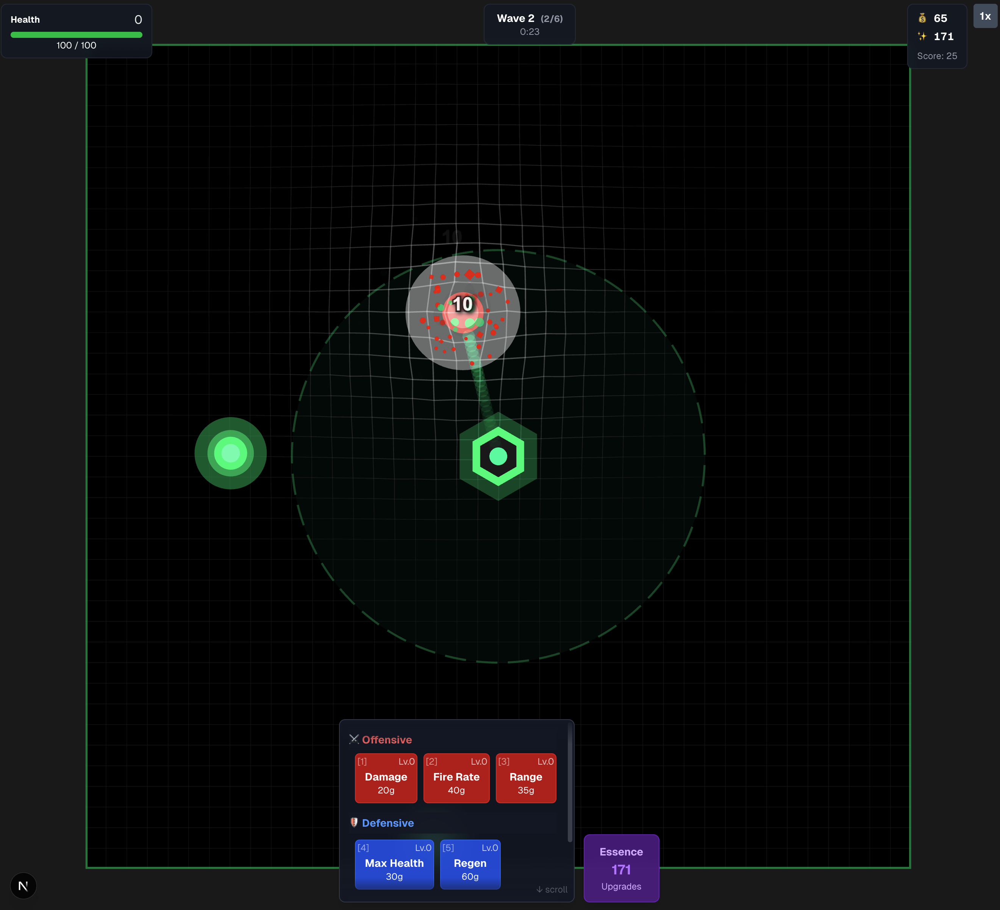

# Tower Defense Game 🏰

A modern tower defense game built entirely by Claude Code - demonstrating AI-powered game development with clean architecture and engaging gameplay.



**[Play the Game →](https://your-game-url.com)**

## About

This is a complete tower defense game featuring:

- 🎮 Wave-based enemy spawning with progressively harder enemies
- 💰 Economic system with upgrades and permanent progression
- ⚡ Active abilities and kill streak bonuses
- 🎨 Smooth animations and visual effects
- 📊 Simulator for testing game balance
- 💾 Persistent progress with essence-based meta-progression

### Built with AI

This entire game was created by Claude Code, showcasing how AI can build production-ready applications with:

- Clean, modular architecture
- Type-safe TypeScript implementation
- Performance-optimized rendering
- Comprehensive game systems

## Getting Started

### Prerequisites

- Node.js 18+ and npm
- Modern web browser with WebGL support

### Installation

```bash
# Clone the repository
git clone https://github.com/mdkess/claude-game.git
cd tower-defense-game

# Install dependencies
npm install

# Run development server
npm run dev

# Build for production
npm run build

# Run tests/simulator
./test-simulator.sh balanced 120 summary
```

### Debug Mode

Access debug features by adding `?debug=true` to the URL:

```
http://localhost:3000/?debug=true
```

Debug mode enables:
- **DEBUG: -100 HP** - Deal 100 damage to your tower
- **DEBUG: +1000 Gold** - Add 1000 gold instantly
- **DEBUG: +100 Essence** - Add 100 essence instantly

## Architecture Overview

The game uses a clean, decoupled architecture with clear separation of concerns:

### Core Systems (`/src/game/`)

```
game/
├── core/
│   ├── GameCore.ts      # Core game logic (no rendering)
│   ├── EventEmitter.ts  # Event system for loose coupling
│   └── constants.ts     # Game configuration
├── entities/
│   ├── Enemy.ts         # Enemy logic (no graphics)
│   ├── Tower.ts         # Tower defense logic
│   └── Projectile.ts    # Projectile physics
├── systems/
│   ├── WaveSystem.ts    # Wave spawning logic
│   ├── CombatSystem.ts  # Combat calculations
│   └── UpgradeSystem.ts # Upgrade progression
├── renderers/
│   ├── EnemyRenderer.ts # PIXI rendering for enemies
│   ├── TowerRenderer.ts # Tower visuals
│   └── ProjectileRenderer.ts
└── Game.ts              # Main game class (extends GameCore with rendering)
```

### Key Design Principles

1. **Separation of Logic and Rendering**

   - `GameCore` contains all game logic without any graphics
   - Renderers handle all visual representation
   - Enables headless simulation for testing

2. **Entity Component System**

   - Entities (Enemy, Tower, Projectile) contain only data and logic
   - Renderers manage the visual representation
   - Clean separation allows for easy testing and different render targets

3. **Event-Driven Architecture**

   - Systems communicate through events
   - Loose coupling between components
   - Easy to extend with new features

4. **Object Pooling**
   - Enemies and projectiles are pooled for performance
   - Reduces garbage collection pressure
   - Smooth performance even with many entities

### Frontend (`/src/components/`)

- **GameCanvas.tsx**: Main React component that initializes the game
- **GameUI.tsx**: HUD and upgrade interface
- **EssenceMenu.tsx**: Permanent upgrade shop

### Simulator (`/src/simulator/`)

- **HeadlessGame.ts**: Extends GameCore for simulation without graphics
- **Simulator.ts**: Runs automated gameplay with different strategies
- **strategies.ts**: AI strategies for testing game balance

## Game Features

### Combat System

- Tower automatically targets nearest enemy
- Projectile physics with collision detection
- Multi-shot and bounce mechanics for upgraded towers

### Wave System

- Hand-crafted early waves for balanced difficulty curve
- Procedural generation after wave 10
- Multiple enemy types:
  - **Basic**: Standard enemies
  - **Swarm**: Fast, weak enemies that spawn in groups
  - **Tank**: Slow, high-health enemies
  - **Splitter**: Enemies that split into swarms when killed

### Upgrade System

#### In-Game Upgrades

- **Offensive**: Damage, Fire Rate, Range
- **Defensive**: Max Health, Health Regeneration
- **Economic**: Gold per Round, Interest

#### Permanent Upgrades (Essence)

- Starting stats boosts
- Economic multipliers
- Special abilities (multi-shot, bounce)

### Special Features

- **Speed Boost**: Active ability with cooldown
- **Kill Streaks**: Chain kills for damage bonuses
- **Perfect Waves**: Bonus gold for taking no damage
- **Interest System**: Earn percentage of current gold per second

## Development

### File Structure

```
src/
├── app/              # Next.js app directory
├── components/       # React components
├── game/            # Game logic and rendering
│   ├── core/        # Core game systems
│   ├── entities/    # Game objects
│   ├── systems/     # Game mechanics
│   ├── renderers/   # Visual components
│   └── effects/     # Visual effects
└── simulator/       # Balance testing tools
```

### Key Technologies

- **React** + **Next.js**: Modern web framework
- **TypeScript**: Full type safety
- **PixiJS v8**: High-performance 2D rendering
- **Tailwind CSS**: Utility-first styling

### Testing & Balance

Run the simulator to test different strategies:

```bash
# Test balanced strategy for 2 minutes
./test-simulator.sh balanced 120 summary

# Test with permanent upgrades
./test-simulator.sh balanced 120 summary 5 2 3 1 1 0.5 0.5

# Test all strategies
for strategy in cheapest damage balanced tank adaptive greedy economic; do
  echo "Testing $strategy..."
  ./test-simulator.sh $strategy 60 summary | grep "Survived:"
done
```

## Contributing

This project was created as a demonstration of AI-powered development. Feel free to:

- Report bugs or suggest features
- Fork and create your own variations
- Use as a template for your own games

## License

MIT License - feel free to use this code for any purpose!

## Acknowledgments

Created entirely by Claude Code (Anthropic's Claude) - demonstrating the capabilities of AI-assisted software development for complex, production-ready applications.

Special thanks to the open-source libraries that made this possible:

- PixiJS for rendering
- Next.js for the framework
- TypeScript for type safety
